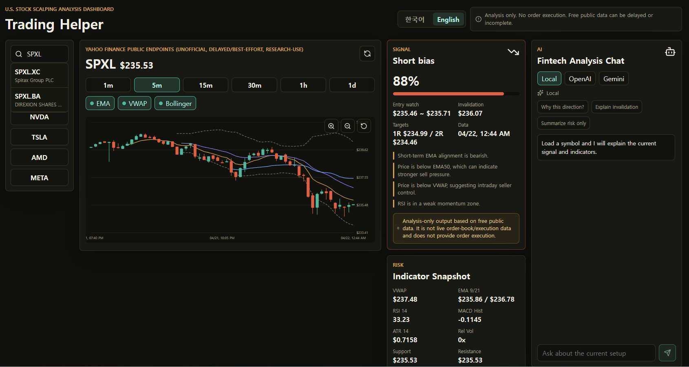
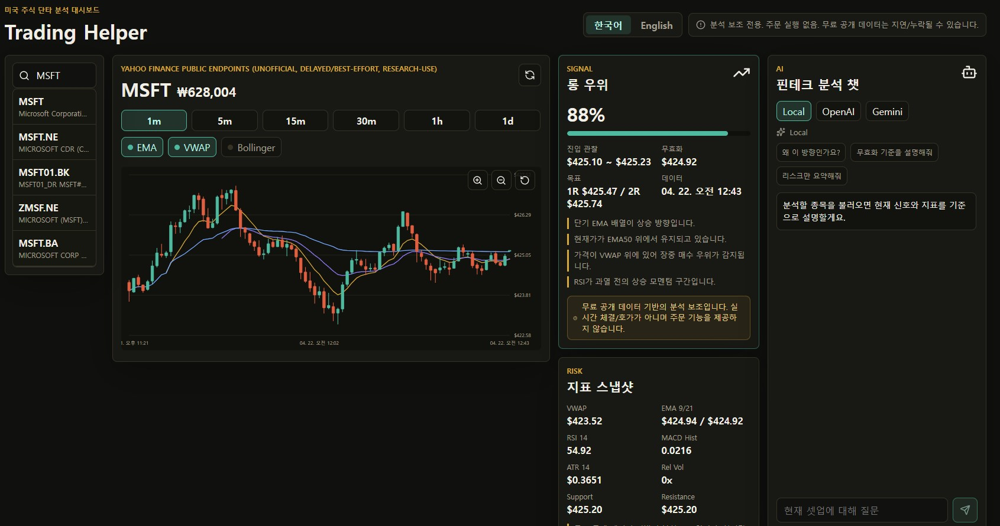

<div align="center">

# Trading Helper

### Local AI-assisted stock analysis dashboard for short-term U.S. equity traders

Trading Helper turns free public market data, technical indicators, long/short/neutral bias, risk levels, and AI explanations into one local dashboard.

[](https://github.com/bluehyena/trading-helper/actions/workflows/ci.yml)
[](./LICENSE)


[](https://github.com/bluehyena/trading-helper/stargazers)
[](https://github.com/bluehyena/trading-helper/forks)
[](https://github.com/bluehyena/trading-helper/watchers)

[English](./README.md) · [한국어](./README.ko.md)

<a href="https://github.com/bluehyena/trading-helper/archive/refs/heads/main.zip">
  
</a>
<a href="#quick-start">
  
</a>
<a href="https://github.com/bluehyena/trading-helper/stargazers">
  
</a>

</div>



## Why Traders Like It

| Built For | What You Get |
| --- | --- |
| Fast discretionary traders | Candles, indicators, bias, invalidation, targets, and risk context in one view |
| Local-first users | Runs on your machine; API keys stay in your `.env` |
| Bilingual teams | Switch between English and Korean directly in the dashboard |
| AI-assisted review | Ask why a setup is long/short/neutral without giving up control of execution |

## Highlights

- Local web dashboard for U.S. equities: watchlist, symbol search, candlestick chart, signal card, risk panel, and AI chat.
- Scroll-wheel chart zoom, icon zoom controls, and drag panning across recent candles.
- Localized price display: English shows USD; Korean converts the displayed U.S. stock price to KRW using the current USD/KRW rate and floors sub-won decimals.
- Built for analysis support only: no broker connection, no order execution, no guaranteed real-time data.
- Technical indicators: EMA 9/21/50/200, VWAP, RSI 14, MACD, Bollinger Bands, ATR, relative volume, OBV, and pivot support/resistance.
- Signal engine outputs `LONG`, `SHORT`, or `NEUTRAL` with confidence, entry watch zone, invalidation, 1R/2R targets, reasons, warnings, and data timestamp.
- BYOK AI providers: OpenAI, Gemini, and a local fallback explanation mode.

## Screenshots

| English | Korean |
| --- | --- |
|  |  |

## Quick Start

### Requirements

- Node.js 24 or newer
- npm 11 or newer
- Git, if you want to clone the repository instead of downloading ZIP

```bash
git clone https://github.com/bluehyena/trading-helper.git
cd trading-helper
npm install
npm run dev
```

Open `http://localhost:3000`.

### Download Without Git

1. Open `https://github.com/bluehyena/trading-helper`.
2. Click `Code`.
3. Click `Download ZIP`.
4. Unzip the file, open a terminal in the extracted folder, then run:

```bash
npm install
npm run dev
```

Optional AI and market data keys:

```bash
cp .env.example .env
```

Then set any keys you want to use:

```bash
OPENAI_API_KEY=
GEMINI_API_KEY=
MARKET_DATA_PROVIDER=yahoo
# MARKET_DATA_PROVIDER=alpha_vantage
ALPHA_VANTAGE_API_KEY=
```

### Production Run

```bash
npm run build
npm start
```

## AI Guardrails

Trading Helper is deliberately analysis-only. The assistant can explain setups, compare indicators, summarize risk, and clarify invalidation, but it does not place trades, connect to brokers, or claim certainty.

## Repository Layout

- `apps/web`: Next.js local dashboard and API routes.
- `packages/core`: market data interfaces, indicator calculations, stale-data checks, and signal engine.
- `packages/ai`: OpenAI, Gemini, and local fallback AI providers.
- `__tests__/e2e`: Playwright smoke tests for the dashboard.

## Scripts

```bash
npm run dev
npm run build
npm start
npm run lint
npm run typecheck
npm run test
npm run test:e2e
```

## Data Policy

The default provider is no-key public data for accessible local use. Because free data can be delayed, incomplete, rate-limited, or governed by third-party terms, the UI labels the source and timestamp directly. Future provider adapters should preserve the same `MarketDataProvider` interface and expose freshness/source metadata.

## Star History

If Trading Helper helps your workflow, a star makes the project easier for other traders and builders to discover.

[](https://star-history.com/#bluehyena/trading-helper&Date)

## Contributing

See [CONTRIBUTING.md](./CONTRIBUTING.md). Korean translation: [CONTRIBUTING.ko.md](./CONTRIBUTING.ko.md).

## Security

See [SECURITY.md](./SECURITY.md). Korean translation: [SECURITY.ko.md](./SECURITY.ko.md).

## Important Disclaimer

Trading Helper is for education and analysis support only. It does not provide personalized financial advice, connect to brokers, execute orders, or guarantee live market data. The default market data path uses unofficial public Yahoo-style endpoints and should be treated as delayed, best-effort, and research-use only.

## License

MIT
